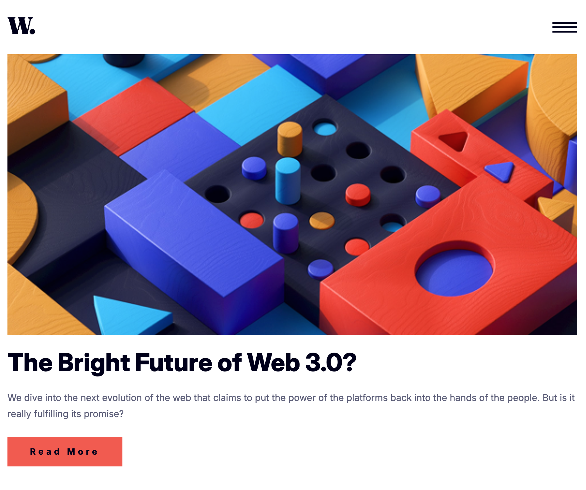

# Frontend Mentor - News homepage solution

This is a solution to the [News homepage challenge on Frontend Mentor](https://www.frontendmentor.io/challenges/news-homepage-H6SWTa1MFl). Frontend Mentor challenges help you improve your coding skills by building realistic projects.

## Table of contents

- [Frontend Mentor - News homepage solution](#frontend-mentor---news-homepage-solution)
  - [Table of contents](#table-of-contents)
  - [Overview](#overview)
    - [The challenge](#the-challenge)
    - [Screenshot](#screenshot)
    - [Links](#links)
  - [My process](#my-process)
    - [Built with](#built-with)
    - [What I learned](#what-i-learned)
    - [Continued development](#continued-development)
    - [Useful resources](#useful-resources)
  - [Author](#author)

## Overview

### The challenge

Users should be able to:

-   View the optimal layout for the interface depending on their device's screen size
-   See hover and focus states for all interactive elements on the page

### Screenshot

### Links

-   Solution URL: [https://github.com/EmLopezDev/News-Homepage](https://github.com/EmLopezDev/News-Homepage)
-   Live Site URL: [https://emlopezdev.github.io/News-Homepage/](https://emlopezdev.github.io/News-Homepage/)

## My process

### Built with

-   Semantic HTML5 markup
-   CSS custom properties
-   Flexbox
-   CSS Grid
-   Mobile-first workflow
-   JavaScript

### What I learned

-   Learned to plan accessiblity better at the beginning of the project to make sure it is included in the process.
-   How to offset navigation when there is a stick header so that the header doesn't cut off the content.

### Continued development

-   I will continue to make sure to prioritize accessiblity so that everyone can feel welcomed in any site/app I create.
-   I would like to build a full website with routes using vanilla JS.

### Useful resources

-   [Offset anchor nav with sticky header](https://www.geeksforgeeks.org/css/how-to-set-offset-an-html-anchor-element-to-adjust-fixed-header-in-css/) - How to offset the anchor navigation when there is a sticky header so it isn't cut off by header.

## Author

-   Frontend Mentor - [@EmLopezDev](https://www.frontendmentor.io/profile/EmLopezDev)
